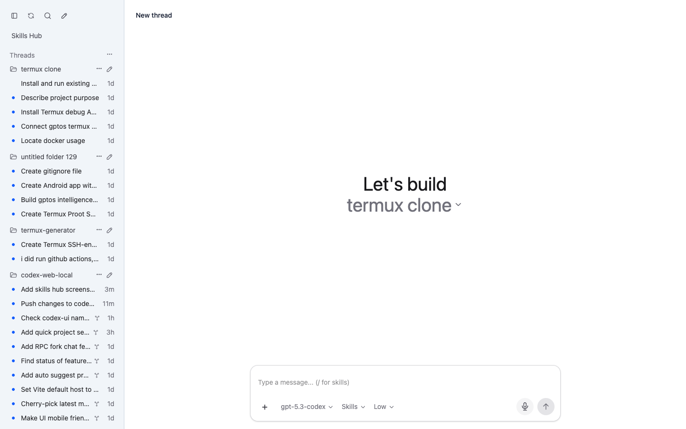
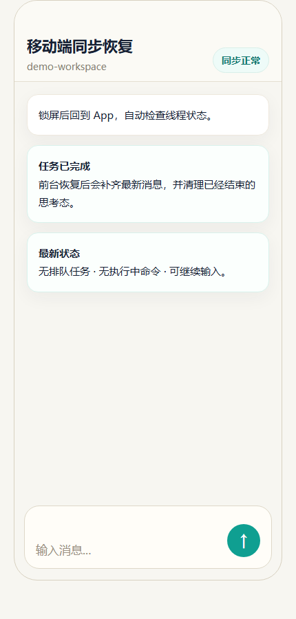
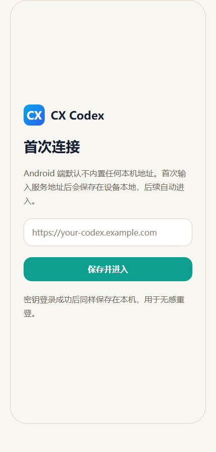
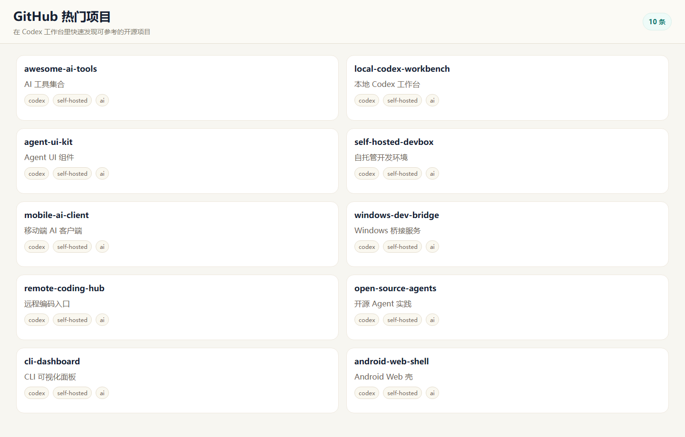
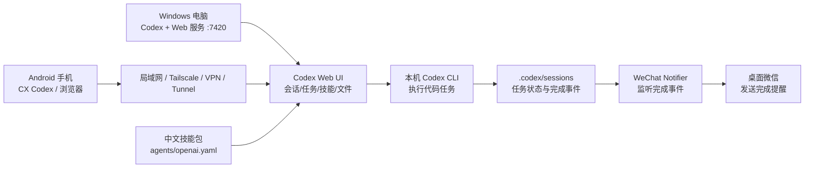

# Codex WeChat Task Reminder

把电脑上的 Codex 变成一套“电脑运行、手机控制、微信提醒、中文技能”的个人 AI 工作台。


> 截图和海报均为脱敏演示素材，不包含真实账号、密码、Token、私有 IP、个人路径或私人会话内容。

## 这是什么

`Codex-WeChat-Task-Reminder` 基于自托管 Codex Web UI / Android 壳，补齐了更适合日常使用的一整套组合：

- **电脑端 Codex 工作台**：Windows 电脑常驻运行 `7420` 服务，复用本机 Codex 登录态和项目目录。
- **手机端远程控制**：Android App 或手机浏览器通过局域网、Tailscale、VPN、Cloudflare Tunnel 等方式连接电脑。
- **微信完成提醒**：Codex 长任务跑完后，自动给指定微信联系人发一条完成提醒。
- **中文技能显示**：手机端技能列表读取技能包里的 `agents/openai.yaml`，优先显示中文名称和中文简介，调用时仍保留原始 `name/path`。
- **新手友好部署**：README、Windows 脚本、Android 文档、微信提醒包和测试清单都围绕可复现使用整理。

这个项目适合一个人自用，或者打包给朋友在自己的电脑上部署。它不是官方 Codex 替代品，也不是多人 SaaS 平台。

## 产品截图

桌面工作台：



手机会话：



Android 首次连接：



GitHub 热门项目模块：



## 工作原理



推荐安全边界：

- 只给自己用时，优先使用 Tailscale、ZeroTier、VPN 或局域网。
- 如果必须公网访问，请设置强密码，并优先放在 Cloudflare Tunnel、反向代理鉴权或其他受控入口后面。
- 不要把无密码的 `0.0.0.0:7420` 暴露到公网。

## 一键安装 Windows 服务

在 Windows PowerShell 里运行：

```powershell
Set-ExecutionPolicy Bypass -Scope Process -Force; irm https://raw.githubusercontent.com/LinYiXin123/Codex-WeChat-Task-Reminder/main/scripts/bootstrap-windows.ps1 | iex
```

默认本机访问地址：

```text
http://127.0.0.1:7420
```

如果你希望尽量不占 C 盘，可以指定安装目录和工作目录，例如：

```powershell
& ([scriptblock]::Create((irm 'https://raw.githubusercontent.com/LinYiXin123/Codex-WeChat-Task-Reminder/main/scripts/bootstrap-windows.ps1'))) `
  -InstallDir "F:\Apps\Codex-WeChat-Task-Reminder" `
  -WorkspacePath "F:\CodexWorkspace" `
  -Port 7420 `
  -Password "change-me"
```

安装脚本会尝试完成：

- 下载并构建本项目
- 生成 `7420` 固定端口配置
- 创建启动脚本
- 尝试放通防火墙端口
- 可选注册开机或登录后自动启动

## 手机怎么连

电脑和手机在同一个局域网时，手机填：

```text
http://电脑局域网IP:7420
```

跨网时推荐 Tailscale。电脑和手机都登录同一个 Tailscale 账号后，手机填其中一种：

```text
http://电脑Tailscale-IP:7420
http://电脑MagicDNS名称:7420
```

例如：

```text
http://100.x.y.z:7420
http://your-pc.tailxxxxx.ts.net:7420
```

Android 壳文档：

- [docs/android-shell.zh-CN.md](./docs/android-shell.zh-CN.md)

## 微信完成提醒

独立提醒包在：

- [tools/codex-wechat-notifier/README.md](./tools/codex-wechat-notifier/README.md)

最小流程：

1. 电脑微信保持登录。
2. 把 `tools/codex-wechat-notifier` 复制到一个固定目录，例如 `D:\CodexWeChatNotifier` 或 `F:\Apps\CodexWeChatNotifier`。
3. 修改 `config.json` 里的 `desktopWeChatTargetName`，填你要收到提醒的微信联系人名。
4. 运行 `install.ps1` 注册常驻和开机自启。
5. 运行 `bin\test-send.ps1`，先确认能发出测试消息。

示例：

```powershell
powershell -ExecutionPolicy Bypass -File F:\Apps\CodexWeChatNotifier\install.ps1
powershell -ExecutionPolicy Bypass -File F:\Apps\CodexWeChatNotifier\bin\test-send.ps1
```

## 中文技能怎么显示

手机端技能选择器会优先读取每个技能目录下：

```text
agents/openai.yaml
```

示例：

```yaml
display_name: 文档处理
short_description: 创建、编辑、校对 Word / PDF / Markdown 文档。
```

读取后：

- 手机技能列表显示 `文档处理` 和中文简介。
- 搜索可以搜中文，也可以搜原始英文技能名。
- 真正发送给 Codex 的技能仍使用原始 `name/path`，不会破坏调用兼容性。

如果你使用中文技能包，可以参考：

- [LinYiXin123/codex-skills-chinese](https://github.com/LinYiXin123/codex-skills-chinese)

## 20 句常用指令模板

可以直接在手机端或微信里复制使用：

1. `帮我看一下当前项目的结构，告诉我从哪里开始改。`
2. `检查最近一次报错日志，先定位原因，不要急着改代码。`
3. `帮我实现这个功能，并在完成后运行相关测试。`
4. `把这段代码重构得更清晰，但不要改变行为。`
5. `帮我检查有没有明显 bug、边界情况和缺少的测试。`
6. `把当前任务拆成 3 到 5 步，并先执行第一步。`
7. `帮我生成一份新手能看懂的使用说明。`
8. `把 README 更新成适合开源项目展示的版本。`
9. `帮我把这个脚本改成可以一键运行，并写清楚参数。`
10. `检查 C 盘空间占用，只列安全可清理项，不要直接删除。`
11. `帮我查看 Docker / Node / Python 环境是否正常。`
12. `把这个功能做成开机自启，但要保留关闭和卸载方式。`
13. `帮我整理今天的待办，按紧急程度排序。`
14. `每天早上 7 点提醒我今天的天气和待办。`
15. `每天晚上 22 点提醒我明天天气和明日计划。`
16. `帮我总结这个会话里已经完成了什么，还剩什么。`
17. `帮我把这段英文技术文档翻译成中文，术语保持准确。`
18. `帮我生成一份发布说明，重点写用户能感知到的变化。`
19. `先读代码再改，不要猜；如果有风险先告诉我。`
20. `完成后给我一句微信提醒格式的总结。`

## 手动运行

```bash
npx codexapp
```

固定端口和密码：

```powershell
npx codexapp --host 0.0.0.0 --port 7420 --no-tunnel --password "change-me"
```

配置文件优先级：

1. `--config <path>`
2. `CODEXUI_CONFIG`
3. `./codexui.config.json`
4. `~/.codexui/config.json`

示例配置：

```json
{
  "host": "0.0.0.0",
  "port": 7420,
  "password": "replace-with-your-password",
  "tunnel": false,
  "open": false,
  "projectPath": "F:\\CodexWorkspace"
}
```

## 让 Codex 直接部署

你也可以把下面这段发给目标电脑上的 Codex：

```text
打开并检查 https://github.com/LinYiXin123/Codex-WeChat-Task-Reminder 这个仓库。
请在这台机器上用最简单、最稳的方式部署这个项目。

要求：
- 创建一个稳定的 Codex Web UI 服务，端口固定为 7420
- 优先使用仓库自带 bootstrap 或 setup 脚本
- 如果这台机器已经登录过 Codex，尽量复用现有登录态
- 尽量开启本机浏览器访问和局域网访问
- 如果机器允许，配置开机或登录后自动启动
- 完成后输出：本机访问地址、局域网访问地址、Tailscale 地址、密码、重启命令、卸载方式

直接执行部署，不要只给步骤说明。
```

## 功能清单

- Codex Web UI browser bridge
- Android CX Codex client shell
- Tailscale / 局域网 / VPN / Tunnel 自托管访问
- 手机端中文技能名和中文简介显示
- 移动端恢复补同步
- 线程列表、会话内容、执行状态和停止状态展示
- 消息收藏、置顶、复制和跳转
- 本地文件链接和图片预览
- GitHub 热门项目模块
- MCP / 工具权限控制
- Windows bootstrap 和发布包
- 健康检查、回归脚本和浸泡脚本
- 独立微信完成提醒包：`tools/codex-wechat-notifier`

## 文档

- 中文入口: [README.zh-CN.md](./README.zh-CN.md)
- Android 壳: [docs/android-shell.zh-CN.md](./docs/android-shell.zh-CN.md)
- Windows Server 安装: [docs/windows-server.md](./docs/windows-server.md)
- Cloudflare Tunnel: [docs/cloudflare-tunnel.zh-CN.md](./docs/cloudflare-tunnel.zh-CN.md)
- 独立微信提醒包: [tools/codex-wechat-notifier/README.md](./tools/codex-wechat-notifier/README.md)
- 更新日志: [docs/changelog.zh-CN.md](./docs/changelog.zh-CN.md)
- 发版说明: [RELEASE.md](./RELEASE.md)
- 路线图: [docs/roadmap.zh-CN.md](./docs/roadmap.zh-CN.md)
- 贡献指南: [CONTRIBUTING.md](./CONTRIBUTING.md)
- 安全策略: [SECURITY.md](./SECURITY.md)

## GitHub 搜索关键词

Codex WeChat reminder, Codex Android client, Codex mobile workbench, self-hosted Codex, Codex Web UI, Windows Codex UI, Tailscale Codex, WeChat task notification, local AI coding agent, Chinese Codex skills.

## 隐私与安全

- 不要提交真实微信聊天截图、真实公网地址、密码、Token、Cookie 或个人目录。
- 不要默认无密码暴露公网。
- 给朋友使用时，请让对方自己填写微信联系人、访问密码和 Tailscale 地址。
- 开源仓库里的截图建议全部使用脱敏演示数据。

## 上游说明

本项目基于自托管 Codex Web UI / Android bridge 思路继续整理和扩展，重点补齐中文用户日常使用需要的微信提醒、手机远程、中文技能展示和新手文档。
