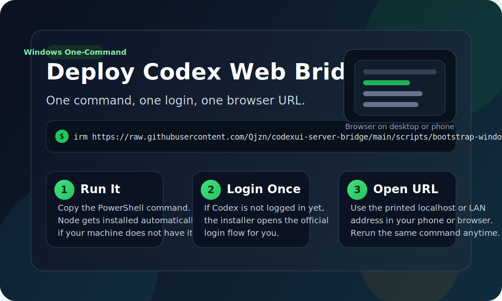
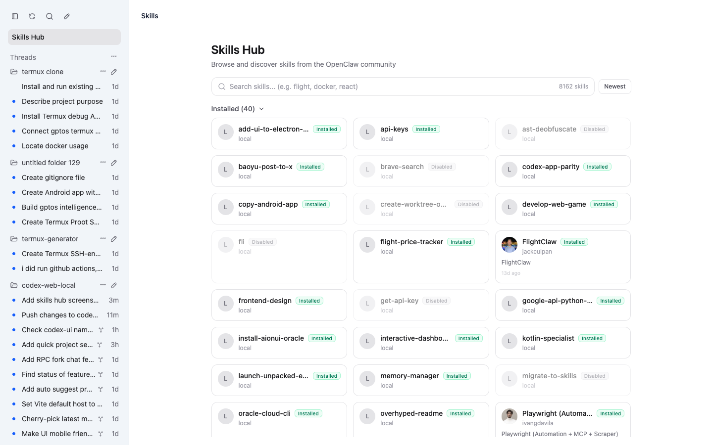

# codexui-server-bridge

把本机 Codex 变成可从手机和浏览器访问的稳定工作台。
5 分钟部署，Windows / Windows Server 友好，适合局域网、自托管远程访问和日常移动使用。



默认中文说明见本文件。

- 中文兼容页: [README.zh-CN.md](./README.zh-CN.md)
- 中文更新日志: [docs/changelog.zh-CN.md](./docs/changelog.zh-CN.md)
- 中文发版说明: [RELEASE.md](./RELEASE.md)
- 路线图: [docs/roadmap.zh-CN.md](./docs/roadmap.zh-CN.md)
- GitHub 包装文案包: [docs/github-launch-kit.zh-CN.md](./docs/github-launch-kit.zh-CN.md)
- Cloudflare Tunnel: [docs/cloudflare-tunnel.zh-CN.md](./docs/cloudflare-tunnel.zh-CN.md)
- 中文部署提示词: [docs/deploy-with-codex.zh-CN.md](./docs/deploy-with-codex.zh-CN.md)
- English deploy prompt: [docs/deploy-with-codex.en.md](./docs/deploy-with-codex.en.md)

## 一句话卖点

这个项目不是要替代官方 Codex，而是补上官方桌面端之外最常见的一块需求：

- 让本机 Codex 稳定出现在浏览器里
- 让手机也能继续看、继续发、继续跟进任务
- 让 Windows 和 Windows Server 用户少踩部署坑
- 让远程访问尽量接近“一条命令可用”

如果你需要的是：

- 在电脑上跑 Codex，手机浏览器继续使用
- 在 Windows Server 上常驻一个可访问的 Codex Web 入口
- 用 Cloudflare Tunnel、Tailscale、反向代理把本地 Codex 暴露出去
- 继续复用现有 Codex 登录态、项目目录和本地文件

这个项目就是为这几个场景做的。

## 为什么值得用

相比“自己拼一套 Web 前端 + 反代 + 脚本”，这个项目的重点不是花哨，而是少折腾：

- 一条命令安装，优先走自带 bootstrap 脚本
- 首先照顾 Windows / Windows Server，自带固定端口和常驻思路
- 默认适配手机浏览器，不要求额外客户端
- 继续复用本机 Codex，而不是重建另一套账号或云端系统
- 支持本地文件浏览、图片回显、会话队列和线程状态恢复
- 支持 Cloudflare Tunnel 这类“零公网 IP 也能先用起来”的远程入口

## 看图理解

桌面端：


手机端：


技能中心：



## 最快部署方式

如果目标机器上的 Codex 已经能执行命令，最快的方式不是手动装，而是直接让 Codex 自己部署。

仓库地址：

```text
https://github.com/Qjzn/codexui-server-bridge
```

把下面这段提示词直接给目标机器上的 Codex：

```text
打开并检查 https://github.com/Qjzn/codexui-server-bridge 这个仓库。
请在这台机器上用最简单、最稳的方式部署这个项目。

要求：
- 创建一个稳定的 Codex Web UI 服务，端口固定为 7420
- 尽量优先使用仓库里自带的 bootstrap 或 setup 脚本
- 如果这台机器已经登录过 Codex，就尽量复用现有登录态
- 尽量开启本机浏览器访问和局域网访问
- 如果机器允许，配置开机或登录后自动启动
- 完成后输出：本机访问地址、局域网访问地址、密码、重启命令

直接执行部署，不要只给步骤说明。
```

## Windows 一条命令安装

```powershell
Set-ExecutionPolicy Bypass -Scope Process -Force; irm https://raw.githubusercontent.com/Qjzn/codexui-server-bridge/main/scripts/bootstrap-windows.ps1 | iex
```

安装脚本会自动完成这些事：

- 安装可用的 Node.js
- 下载仓库到本地
- 构建前端和 CLI
- 生成默认配置
- 创建启动脚本
- 尝试放通 `7420`
- 立即启动服务

安装完成后，直接在浏览器或手机里打开输出的地址即可。

## Windows 一条命令开启公网临时访问

如果没有公网 IP、不想配置路由器端口映射，可以使用 Cloudflare 快速隧道：

```powershell
& ([scriptblock]::Create((irm 'https://raw.githubusercontent.com/Qjzn/codexui-server-bridge/main/scripts/bootstrap-windows.ps1'))) -EnableCloudflareTunnel
```

脚本会自动下载 `cloudflared.exe`，启动后在日志里输出 `https://*.trycloudflare.com` 地址。长期固定域名请看：

- [Cloudflare Tunnel 远程访问](./docs/cloudflare-tunnel.zh-CN.md)

## 典型使用场景

### 1. 电脑跑 Codex，手机继续跟进

- 在 Windows 电脑上执行 Codex
- 手机浏览器直接访问 `7420`
- 出门后继续看会话、继续发新任务、继续跟进执行状态

### 2. Windows Server 常驻入口

- 在 Windows Server 上固定跑一个 Codex Web 服务
- 局域网、VPN 或远程入口统一访问
- 适合长期挂着，不想每次重新找命令和路径

### 3. 自托管远程访问

- 没有公网 IP 也可以先用 Cloudflare Tunnel 起一个临时公网地址
- 后续再切换到 Tailscale、frp、Nginx 或 Caddy
- 保持本地登录态、本地文件和本地项目目录

## 当前最有价值的能力

- 固定端口和配置文件驱动启动
- Web UI 与本地 Codex app-server 桥接
- 手机端和桌面端统一访问
- 本地文件浏览 / 编辑 / 图片查看
- 执行中继续排队发消息，引用可立即插队执行
- 更稳定的线程状态恢复、消息补同步和移动端体验
- Cloudflare Tunnel 快速隧道支持

## 最近维护重点

当前主线已经覆盖这些改进：

- MCP 补充信息请求改为可理解的待输入卡片，不再暴露底层方法名
- 线程切换更快响应，减少“点第二个线程还卡在第一个”的情况
- 空线程 deep link、空线程移除、空线程恢复边界收口
- 图片上传与本地图片回显链路修正
- 执行中新增消息默认进入队列，支持引用立即执行
- 队列持久化与稳定性修复，避免提前出队导致丢消息
- 会话区命令卡片只保留执行中状态，完成后不再堆积
- 侧栏新增“全部已读”
- “刷新桌面端”入口改到设置面板
- Cloudflare Tunnel 状态、版本号和 GitHub 仓库入口进入设置面板
- 全局 UI/UX 收口，手机端和侧栏交互更简约

详细记录见：

- [docs/changelog.zh-CN.md](./docs/changelog.zh-CN.md)

## 这不是一个什么项目

为了减少误解，这里说清楚边界：

- 不是官方 Codex 替代品
- 不是多用户 SaaS 平台
- 不是重依赖数据库和云端账号体系的复杂服务
- 不是“先做十个高级功能、再解决安装门槛”的产品路线

当前方向很明确：

- 先把本地 Codex 浏览器入口做稳
- 先把手机和远程访问做顺
- 先让普通用户低门槛跑起来

## 手动运行

### 本地快速启动

```bash
npx codexapp
```

默认打开：

```text
http://localhost:18923
```

### 固定到 7420

```powershell
npx codexapp --host 0.0.0.0 --port 7420 --no-tunnel --password "change-me"
```

如果直接启用快速隧道：

```powershell
npx codexapp --host 0.0.0.0 --port 7420 --tunnel
```

程序会优先查找本机 `cloudflared`，找不到时会在交互终端提示自动安装到用户目录。也可以显式指定：

```powershell
npx codexapp --host 0.0.0.0 --port 7420 --tunnel --cloudflared-command "C:\\Users\\your-user\\.local\\bin\\cloudflared.exe"
```

### 配置文件方式

优先级：

1. `--config <path>`
2. `CODEXUI_CONFIG`
3. `./codexui.config.json`
4. `~/.codexui/config.json`

示例：

```json
{
  "host": "0.0.0.0",
  "port": 7420,
  "password": "replace-with-your-password",
  "tunnel": false,
  "open": false,
  "projectPath": "C:\\Users\\your-user\\Documents\\Playground",
  "cloudflaredCommand": "C:\\Users\\your-user\\.local\\bin\\cloudflared.exe"
}
```

示例配置：

- [codexui.config.example.json](./codexui.config.example.json)

## 相关文档

- Windows Server 安装: [docs/windows-server.md](./docs/windows-server.md)
- Cloudflare Tunnel 远程访问: [docs/cloudflare-tunnel.zh-CN.md](./docs/cloudflare-tunnel.zh-CN.md)
- 项目路线图: [docs/roadmap.zh-CN.md](./docs/roadmap.zh-CN.md)
- GitHub 包装文案包: [docs/github-launch-kit.zh-CN.md](./docs/github-launch-kit.zh-CN.md)
- Release 文案模板: [docs/release-template.zh-CN.md](./docs/release-template.zh-CN.md)
- 贡献指南: [CONTRIBUTING.md](./CONTRIBUTING.md)
- 安全策略: [SECURITY.md](./SECURITY.md)
- 发版说明: [RELEASE.md](./RELEASE.md)
- 更新日志: [docs/changelog.zh-CN.md](./docs/changelog.zh-CN.md)

## 反馈与贡献

- 安装部署问题请使用 `Install` Issue 模板
- 稳定性、同步、手机端体验问题请使用 `Bug` Issue 模板
- 新能力建议请使用 `Feature` Issue 模板
- 提交前请先脱敏密码、Token、Cookie、真实公网地址和个人目录

## 隐私与发布约定

发布说明和 Release 资产默认只保留通用示例，不包含：

- 私人账号
- 本地密码
- 私有 IP
- 个人目录
- 机器专属路径

## Fork 来源

[pavel-voronin/codex-web-local](https://github.com/pavel-voronin/codex-web-local)  
→ [friuns2/codexui](https://github.com/friuns2/codexui)  
→ [Qjzn/codexui-server-bridge](https://github.com/Qjzn/codexui-server-bridge)
